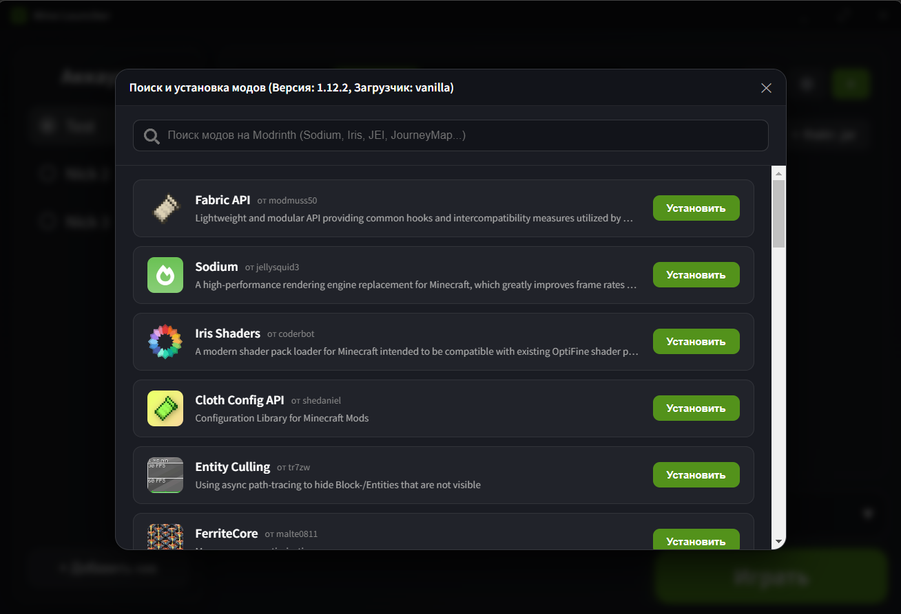

  
  
  
  
  
Крутой майнрафт лаунчер
##Запуск

```bash
# cd
cd mine-launcher

# Установка зависимостей
npm install

# Запуск
npm run dev

# Компиляция
npm run compile

# Сборка 
npm run build
```

---

<p align="center">
  MIT License · 2026 gitbrou
</p>
